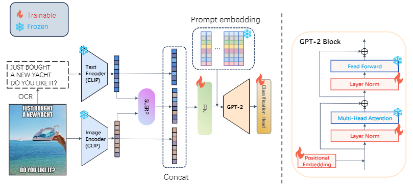

# CDGLT

The official implementation for the paper titled: "Concept Drift Guided LayerNorm Tuning for Efficient Multimodal Metaphor Identification"



## Install the Requirements

```
conda create -n CDGLT python==3.8.0
pip install -r requirement.txt
```

## Preparation

Download image data: [here](https://www.kaggle.com/datasets/liaolianfoka/met-meme?resource=download-directory&select=Eimages)

Download label file: [here](https://www.kaggle.com/datasets/liaolianfoka/met-meme?resource=download-directory&select=label_E.csv)

Download OCR content of memes: [here](https://www.kaggle.com/datasets/liaolianfoka/met-meme?resource=download-directory&select=E_text.csv)

Download the dataset division file: [here](https://pan.baidu.com/s/16ZAM8gDYZKZut1sDKgJGJA?pwd=33p3) (
The 6/2/2 dataset division given by [Vincy2King/M3F-MEME](https://github.com/Vincy2King/M3F-MEME) adopted in our experiments.)

The structure of `data` directoty:

```
-data/
    -Eimages/
        -Eimages/
    -avg_test_label_E
    -avg_train_label_E
    -avg_val_label_E
    -E_text.csv
    -label_E.csv
```

**Note**：The `label_E.csv` and `E_text.csv` offered by [kaggle](https://www.kaggle.com/datasets/liaolianfoka/met-meme?resource=download-directory&select=E_text.csv) have some flaw in encoding. It can be solved by openning them with VScode then clicking `Select Encoding` -> `Save with Encoding` -> `UTF-8`. The repaired files is provided by us in `data` directory of this repository.

The pretrained CLIP model we used: [openai/clip-vit-large-patch14](https://huggingface.co/openai/clip-vit-large-patch14)

The pretrained GPT-2 model we used: [openai-community/gpt2](https://huggingface.co/openai-community/gpt2)

## Divide the Dataset:

Obtain the 6/2/2 **train/val/test** label files of each specific tasks:

```
# {YOUR_PATH}/Metor$
cd ./utils
python split_train_val_test.py
```

Then the split files will be written in `data/E_split/`

Task 0: **S**entiment **A**nalysis; 1: sentiment analysis; 2: **I**ntention **D**etection; 3: **O**ffensiveness **D**etection; 4: **M**etaphor **I**dentification

The first columns in the obtained `.csv` files represent the IDs of images (e.g. the ID of file named `image_ (26).jpg` is 26)

## Extract the embeddings and text prompt tokens

```
cd ./utils
python write_clipText_feature.py
python write_clipViT_feature.py
python write_gpt2_prompt_tokenid.py
```

Embeddings and GPT2 tokenIDs will be written in `feature/cache_E`

### Start Training

```
bash ./train_MI.sh
```

This bash script uses the nohup command, so the python program will run in the background and redirect std output to a log file.
